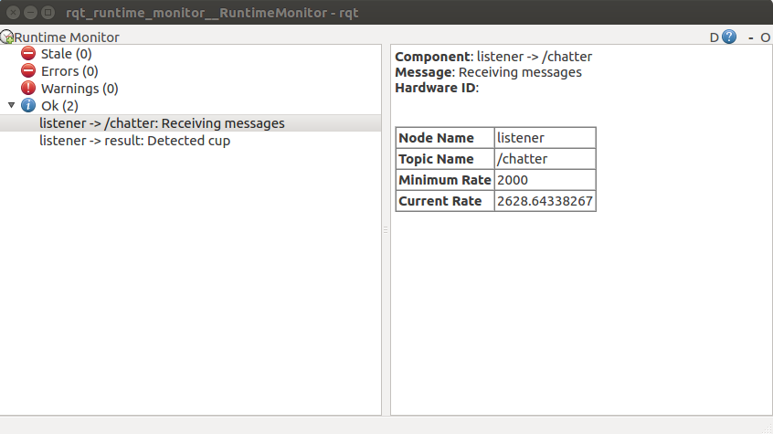
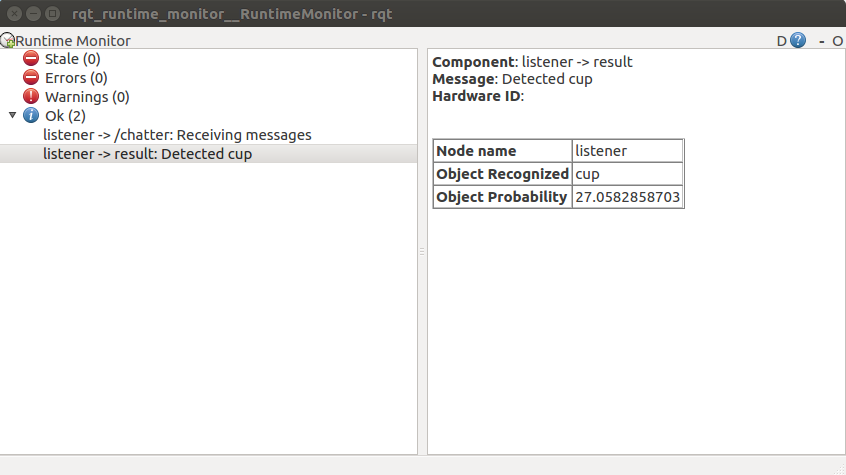

# Integration

Here we discuss how to integrate functional level node monitoring into your Python code. 

This code is simply an **example**. If you want to integrate it into your node, the current method is to:
- **copy** what you will need from listener.py into your code such as imports, classes and functions.
- In the main function:
    - If you are just interested in monitoring topics, go to **Common Necessities** and **Monitoring Topics** below to see what you need to do.
    - If you are just interested in sending a result from your node to be viewed on the console, go to **Common Necessities** and **Send a Result** below to see what you need to do.

## Common Necessities
- Initialize the node.
```py
#initialize node
nodename = "listener"
rospy.init_node(nodename, anonymous=True)
```
 - Specify the rate at which you want the diagnostics message to be published at. Typically keeping it at a low number is good. Once per second is fine.
 ```py
#rate at which the diagnostic messages will be published
rate = rospy.Rate(1)
```
## Monitoring Topics
- Declare the topic that this node will subscribe to.
```py
topicname = "/chatter"
```
- Declare the topic's message type.
```py
topictype = String
```
- Declare the minimum publishing rate of the topics that your node is subscribed to.
```py
min_rate = 2600
```
- We will use this to call the function to get the current publishing rate later. Window_size must be set to lower than 0 to get the pubish rate.
```py
rt = ROSTopicHz(-1, None)
```
- Subscribe to the topic.  
 ```py
#subscribe to the topic and run callback to check if the data messages are empty or not
rospy.Subscriber(topicname, topictype, data_callback)

#subscribe once again to get the rate of publishing messages by calling rt.callback_hz everytime a message is published
rospy.Subscriber(topicname, topictype, rt.callback_hz)
 ```

 - We will publish to the diagnostics topic.

 ``Note: If you want to publish two different sets of messages, you will need to create another instance of rospy.Publisher.``
 ```py
#you will need to create one pub per topic you are subscribed to.
pub = rospy.Publisher('diagnostics', diagnostic_msgs.msg.DiagnosticArray, queue_size=10)
 ```

- Start the function inside a loop. Must be started inside a loop because diagnostics will keep updating.
```py
while not rospy.is_shutdown():
    topic_diagnostics(topicname, nodename, rt, pub, topictype, min_rate, data)
    rate.sleep()
```

- After you are finished, run the rqt_runtime_monitor and you should see something similar to the image below.



## Send a Result
- We will publish to diagnostics topic.

``Note: If you want to publish two different sets of messages, you will need to create another instance of rospy.Publisher.``
```py
pub2 = rospy.Publisher('diagnostics', diagnostic_msgs.msg.DiagnosticArray, queue_size=10)
```
- Example of getting a result that we will send to the diagnostics topic to be viewed on the console.
```py
#example of transferring a variable from this node to diagnostics topic
#example : object recognition will recognize one of these objects and send answer to diagnostics topic
data = BoundingBox()
object = ['dog', 'cat', 'truck', 'person', 'tree', 'cup', 'table', 'chair', 'beer', 'chicken']
r = random.randint(0,9)
data.Class = object[r]
data.probability = random.uniform(0, 100)
```

 - You should have the node_result function inside a loop to run as long as the node is active.
 ```py
while not rospy.is_shutdown():
    #send a result to be viewed on the console; in this case, data
    node_result(nodename, pub2, data)
    rate.sleep()
 ```

 - After you are finished, run the rqt_runtime_monitor and you should see something similar to the image below.


 
 ### Customize

- You can customize the messages that will be displayed.

```py
# Enum for declaring a set of constants
class DataInfo(Enum):
    #Describe a small message content
    msg_wrong = "Not receiving message from topic"
    msg_correct = "Receiving messages"
    rate_normal = "Publish rate is normal"
    rate_low = "Publish rate is too low"
    rate_none = "Publish rate is at 0"

```

- You can modify all the key value pairs that will apear in table form. You can add or remove depending on your purpose. The values must be in String form.

```py
statusMsg.values.append(
            diagnostic_msgs.msg.KeyValue("Node Name", nodename)
        )
statusMsg.values.append(
            diagnostic_msgs.msg.KeyValue("Topic Name", topicname)
        )
statusMsg.values.append(
            diagnostic_msgs.msg.KeyValue("Minimum Rate", str(min_rate))
        )
statusMsg.values.append(
            diagnostic_msgs.msg.KeyValue("Current Rate", str(rate[0]))
        )
statusMsg.values.append(
            diagnostic_msgs.msg.KeyValue("Topic Content", content)
        )
statusMsg.values.append(
            diagnostic_msgs.msg.KeyValue("Object Recognized", str(data.Class))
        )
statusMsg.values.append(
            diagnostic_msgs.msg.KeyValue("Object Probability", str(data.probability))
        )
```

## Reference
- http://docs.ros.org/api/diagnostic_msgs/html/msg/DiagnosticStatus.html
- https://github.com/tue-robotics/node_alive
- https://github.com/ros2/ros2cli/blob/master/ros2topic/ros2topic/verb/hz.py
- http://docs.ros.org/jade/api/rostopic/html/rostopic.ROSTopicHz-class.html
- https://answers.ros.org/question/48579/using-rostopic-hz-in-a-ros-node/
- https://github.com/strawlab/ros_comm/blob/master/tools/rostopic/src/rostopic.py